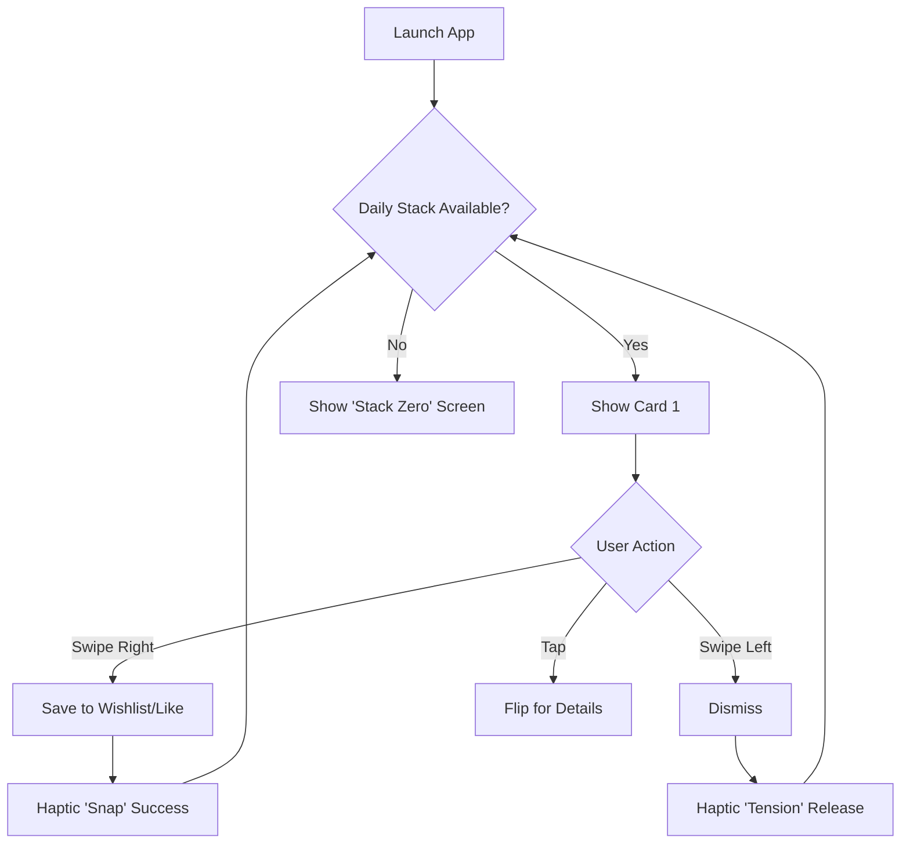

# UX Design Specification: Metacult

**Author:** David
**Date:** 2026-01-07

---

<!-- UX design content will be appended sequentially through collaborative workflow steps -->

## Executive Summary

### Project Vision

"Culture Liquide". Transforming cultural discovery into a fluid, frictionless ritual where triage is played as a game, moving away from static database management to dynamic flow.

### Target Users

- **Alex (The Snacker)**: Seeks speed and flow ("5 minutes in the subway"). Frustrated by unnecessary clicks and decision fatigue. Value: "Reptilian Triage".
- **Sarah (The Curator)**: Seeks precision and identity sculpting. Uses Duels to refine her taste profile. Value: "Identity Building".

### Key Design Challenges

1.  **Reptilian Triage & Error Tolerance ("Forgiving UI")**
    - _Conflict_: Speed vs. Precision.
    - _Solution_:
      - **Smart Deadzone**: Ignore micro-diagonal movements (15°) to prevent accidental swipes.
      - **Panic Button (Undo)**: Permanently visible 'Undo' action to mitigate "Fear of Loss" (FOMO).
      - **Distinct Intent**: Clear separation between _Tap_ (View Details) and _Swipe_ (Action).
2.  **Cognitive Density**:
    - _Challenge_: Enabling 0.5s decision-making requires brutal visual hierarchy (Poster Art >>> Metadata).
    - _Solution_: Prioritize visceral imagery over text density.

### Design Opportunities

- **Tactile Physics (Shadcn/Tailwind Motion)**: Use spring-physics animations to give cards "weight" and momentum, enhancing the physical sensation of the digital interactions.
- **OLED Aesthetic**: Deep blacks and vibrant neons to evoke a "Cinema/Gaming" atmosphere, minimizing eye strain during nighttime use.

## Core User Experience

### Defining Experience

- **The Loop**: An infinite loop fragmented into digestible 5-minute sessions ("Daily Stack" of 20 cards).
- **Gestures**: Single-thumb interaction. Swipe to act, Tap to reveal. No complex menus in the core flow.

### Platform Strategy

- **PWA First**: The experience must be indistinguishable from native apps (iOS/Android).
- **Offline by Default**: The "Daily Stack" is preloaded. The subway commute (offline environment) is a primary use case and must not break the flow.
- **Haptic Feedback**: Subtly vibrate on card interactions to provide physical weight to digital actions (mimicking a physical deck).

### Critical Success Moments

1.  **The "Flow" State**: When the user swipes 10 cards in 10 seconds without cognitive friction. This is the retention hook.
2.  **The "Gem" Discovery**: The moment a card "Matches" (Banger) and goes to Wishlist. The animation must celebrate this epiphany.

### Experience Principles

- **"Thumb-First"**: All primary actions are accessible in the bottom third of the screen.
- **"Speed is a Feature"**: < 16ms latency on interactions. Optimistic UI always.
- **"Respect the Battery"**: Use GPU-accelerated CSS for animations instead of heavy WebGL where possible, optimizing for mobile longevity.
- **"Agency > Passivity"**: Unlike TikTok's zombie-scrolling, Metacult glorifies the _decision_. The UI must make the act of judging (rejecting or keeping) feel powerful and satisfying ("God Mode").

## Desired Emotional Response

### Primary Emotional Goals

- **Power & Agency**: "I am the critic." Unlike passive consumption platforms (TikTok), Metacult empowers the user to be the judge. The user acts on the content, not the other way around.
- **Satisfaction of Triage**: The ASMR-like pleasure of cleaning and organizing. Reaching "Inbox Zero" (an empty deck) provides a dopamine hit of accomplishment.

### Emotional Journey Mapping

1.  **Opening**: _Excitation_. The daily stack is refreshed. A promise of discovery.
2.  **Swiping**: _Flow & Rhythm_. Hypnotic but active state.
3.  **Dislike**: _Relief/Power_. Eliminating noise and refining the signal. "I don't simply skip; I reject."
4.  **Match**: _Epiphany_. Finding a gem amidst the noise. A moment of celebration.
5.  **Empty Deck**: _Accomplishment_. The session is complete. No doom-scrolling loop, but a satisfied exit.

### Micro-Emotions

- **Security vs. FOMO**: The permanent presense of the 'Undo' button transforms the anxiety of a "wrong move" into absolute safety, encouraging faster interactions.
- **Tangibility**: Cards should feel like matter, not pixels. This physical weight gives importance to the judgment call.

### Design Implications

- **Undo Visibility**: Must be prominent, not hidden in a menu, to support the "Security" emotion.
- **End-of-Session UI**: A distinct "You're done for today" screen to trigger the feeling of "Accomplishment" and prevent endless scrolling fatigue.

## UX Pattern Analysis & Inspiration

### Inspiring Products Analysis

- **Tinder (The Dealer)**:
  - _Magic_: The physics of the card (rotation, weight). The "Slot Machine effect" (Who is next?).
  - _Key Interaction_: The tactile resistance and "snap" of the card.
- **TikTok (The Current)**:
  - _Magic_: Zero friction. Optimistic UI makes everything feel instantaneous.
  - _Key Interaction_: The seamless flow between content pieces.

### Transferable UX Patterns

1.  **"Spring Physics"**: Use biological inertia and bounce (via / VueUse Motion). Interactions should not be linear; they should feel alive.
2.  **"Instant Pre-fetch"**: The N+1 card must be rendered and hidden behind card N. Zero loaders between swipes.
3.  **"Proportional Feedback" ("Tension & Snap")**:
    - **Haptic**: Vibration intensity ramps up with drag distance (10% -> 50%).
    - **Visual ("Atmospheric Bleed")**: Background ambient color shifts progressively (e.g., reddens for dislike) before the decision is committed.
    - _Goal_: Avoid binary feedback (Nothing -> Action). Provide progressive feedback (Nothing -> Tension -> Action).

### Anti-Patterns to Avoid

- **The "Zombie Scroll"**: Unlike TikTok's infinite feed, Metacult must have a distinct END ("Stack Complete") to provide a dopamine hit of accomplishment and allow the user to leave satisfied.
- **UI Clutter**: No "Super Like" or "Boost" buttons cluttering the gesture zone. Keep the "thumb arena" sacred.

### Design Inspiration Strategy

**"Hybrid Triage"**: Combine the reckless speed of TikTok with the decisive agency of Tinder.

- _Adopt_: Spring physics and pre-fetching.
- _Adapt_: Proportional feedback to make the "Dislike" action feel like a physical rejection (cleansing), not just a skip.

## Design System Foundation

### 1.1 Design System Choice

- **Foundation**: Shadcn-vue (Headless components).
- **Styling**: TailwindCSS (Utility-first).
- **Motion**: VueUse Motion (Spring physics).

### Rationale for Selection

1.  **"Headless" is Essential**: We must break the standard visual patterns to create the unique "Tinder Card" interaction. Shadcn provides the accessible logic (Dialog, Toast, Form) without imposing a "Corporate Dashboard" style.
2.  **Performance**: Tailwind generates minimal CSS, which is critical for the PWA bundle size and runtime performance.
3.  **Speed**: Utilizing pre-built accessible components for standard UI elements allows 100% focus on the custom "Deck" interaction.

### Customization Strategy

- **"OLED Theme"**: Override Shadcn variables (radius, colors) to create a "Cinema Noir" aesthetic (Deep black backgrounds, Neon borders).
- **"Metacult Radius"**: Use aggressive rounded corners (24px+) to mimic physical playing cards.

## 2. Core User Experience

### 2.1 Defining Experience

**"The Reptilian Swipe"**: See a card, judge it in 0.5s using a physical reflex (Swipe Right/Left), feel the tactile "Snap" validation, and instantly see the next card appear. It is a rhythm game where the score is your curated taste.

### 2.2 User Mental Model

- **Current State**: Users associate "Swipe" with casual dating (Tinder) or "Doomscrolling" (TikTok).
- **Metacult Twist**: We pivot the swipe from "Low Cognition Consumption" to **"High Cognition Curation"**. The gesture remains simple, but the intent is elevated. It's not just "passing time"; it's "building a museum".

### 2.3 Success Criteria

1.  **Speed**: Decision time under 500ms per card.
2.  **Rhythm**: The interface must support a trance-like state ("Flow"). Any lag breaks the spell.
3.  **Agency**: The user must feel they are _constructing_ something (a Wishlist, a Profile), not just consuming a feed.

### 2.4 Novel UX Patterns

- **"Stack Zero" (Inbox Zero for Culture)**: Unlike infinite feeds, the Daily Stack HAS an end. Reaching the end triggers a "Completion" celebration. This creates a healthy "stopping cue" and a sense of daily accomplishment.

### 2.5 Experience Mechanics

1.  **Initiation**: Open App -> Instant Stack. No Home Screen choices, no menu navigation. Direct immersion.
2.  **Interaction**: Bottom-thumb zone. Drag > 15% initiates feedback (tension). Drag > 50% commits action (snap).
3.  **Completion**: When the stack is empty, a specific "You are up to date" screen appears. This is the "Exit Point" that leaves the user satisfied, not exhausted.

## Visual Design Foundation

### Color System

**Theme**: "OLED Cinema" (Dark Mode First).

- **Backgrounds**: (Deep Carbon) for main background to save battery on OLED and reduce eye strain. for cards to lift them from the void.
- **Primary (Brand)**: (Mystery/Culture/Digital).
- **Semantic Feedback**:
  - **Like**: (Neon Green) - Vibrant, positive energy.
  - **Dislike**: (Vibrant Red) - Clear, destructive action.
  - **Wishlist**: (Gold) - Precious, collection-worthy.

### Typography System

- **Headings (Display)**: **Outfit** or **Syne** (Google Fonts). Geometric sans-serifs with personality to frame cultural content like movie posters.
- **Body (UI)**: **Inter**. Standard, highly legible at small sizes for metadata (Year, Director, Genre).

### Spacing & Layout Foundation

- **Base Unit**: 4px.
- **Card Aspect Ratio**: (Standard Movie Poster ratio).
- **Touch Targets**: Minimum 44px for all interactable elements.
- **Radius**:
  - Cards: (24px) - Mimics physical playing cards, friendly.
  - Buttons: - Pill shapes for actions.

### Accessibility Considerations

- **Contrast**: Ensure text on meets WCAG AA standards.
- **Haptics as Accessibility**: Vibration cues help users confirm actions without relying solely on color changes (Red/Green).

## Design Direction Decision

### Design Directions Explored

1.  **Cinematic Immersive**: Full-bleed, transparent UI, focused on flow (TikTok-like).
2.  **Museum Curator**: Framed content, distinct interactions, editorial feel.
3.  **Arcade Triage**: Gamified, large controls, high contrast.

### Chosen Direction

**"The Immersive Curator" (Hybrid 1 + 2)**
We combine the **scale** of Cinematic with the **sophistication** of Museum Curator.

- **From Cinematic**: Full-bleed, edge-to-edge imagery. No hard frames reducing the viewport. The content is the interface.
- **From Museum**:
  - **Typography**: Editorial, high-personality headers (Outfit/Syne) rather than generic app overlays.
  - **Legibility**: Intelligent "scrims" (gradients) to ensure metadata is readable as if on a gallery plaque, not just floating white text.
  - **Respect**: The UI gets out of the way, but what remains feels premium, not utilitarian.

### Design Rationale

This hybrid supports our dual emotional goals:

1.  **Immersion (Flow)**: The full-bleed visuals prevent the interface from feeling "boxy" or heavy, encouraging the "Reptilian Swipe".
2.  **Value (Culture)**: The precise typography and deliberate metadata layout signal that this is _Culture_, not just "Content". It frames the movie/game as art worth collecting.

### Implementation Approach

- **Layout**: (Dynamic Viewport Height) containers.
- **Visuals**: images with overlays for text protection.
- **Type**: (Outfit) for Titles, positioned with generous leading.

## User Journey Flows

### 1. The Daily Loop (Core Triage)

The primary loop. Users enter, triage their daily stack, and reach a modification point.



### 2. The Arena (Wishlist & ELO Duels)

Users actively refine their taste profile by dueling items from their wishlist. This gamifies the "Sort" function.

```mermaid
graph TD
    A[Access Wishlist] --> B[View Grid (Ranked by ELO)]
    B --> C[Tap 'Refine Rank' / 'Duel']
    C --> D[**THE ARENA** Mode]
    D --> E[Show Item A vs Item B]
    E --> F{Who is better?}
    F -- Pick A --> G[A gains ELO / B loses ELO]
    F -- Pick B --> H[B gains ELO / A loses ELO]
    G --> I[Next Duel Pair]
    H --> I
    I --> J{Quit Arena?}
    J -- No --> E
    J -- Yes --> B
```

### 3. First Launch (Seamless Onboarding)

Zero-friction entry. The tutorial is the first card.

```mermaid
graph TD
    A[First Open] --> B[Splash (0.5s)]
    B --> C[**Tutorial Card**]
    C --> D{Swipe Right}
    D -- Action --> E[Permission Request: Notifications]
    E -- Grant/Deny --> F[**First Real Content Card**]
    F --> G[Start Daily Loop]
```

### Flow Optimization Principles

- **"Stack Zero" Enforcement**: The Daily Loop must end. It is not infinite. This provides a stopping cue.
- **"Duel" Gamification**: Replacing the boring "Sort by Rating" dropdown with an active "A vs B" game makes curation fun and data richer.
- **Invisible Onboarding**: No "Welcome to Metacult" slides. The app _is_ the tutorial.

## Component Strategy

### Design System Components

**Foundation**: Shadcn-vue + Radix UI (Invisible Logic).
We rely on Shadcn for all "utilitarian" needs to save time:

- **Dialogs/Drawers**: For Profile and Settings.
- **Toasts**: For light feedback ("Added to Wishlist").
- **Forms**: for Login/Preferences.

### Custom Components (The "Super Components")

#### 1. `<DuelArena />` (The Gamification Engine)

**Purpose**: Gamify the decision process for refining taste.
**Anatomy**: Split-screen (Top/Bottom on Mobile).
**Interaction**:

- **Tap Top/Bottom**: Voting for the winner.
- **Hold**: expands the half to peek at details.
- **Feedback**: "Punch" animation where the winner expands and pushes the loser off-screen.

#### 2. `<SwipeDeck />` (The Physics Engine)

**Purpose**: Handle the core "Reptilian Triage".
**Tech**: VueUse Motion for spring physics.
**Behavior**:

- **Snap Points**: 50% threshold for commit.
- **Pre-fetch**: Always renders N+1 card invisibly to ensure 0ms latency.

#### 3. `<CinemaCard />` (The Atomic Unit)

**Purpose**: Display cultural content with maximum impact.
**Anatomy**:

- **Layer 1**: Full-height image ().
- **Layer 2**: Smart Scrim (Gradient from bottom).
- **Layer 3**: Typography (Outfit) & Metadata (Inter).
  **States**: Idle, Dragging (Tension), Exiting (Snap).

### Implementation Roadmap

- **Phase 1 (Core)**: Build `<SwipeDeck />` & `<CinemaCard />`. (Essential for MVP).
- **Phase 2 (Game)**: Build `<DuelArena />`. (Essential for Retention).
- **Phase 3 (Pollish)**: Custom loaders and micro-interactions.

## UX Consistency Patterns

### Navigation Patterns

**"Gestural First" Rule**: Do not force users to hunt for a small "X" button.

- **Back Action**: Vertical Drag Down (like closing a photo in iOS/Instagram) or Edge Swipe.
- **Menu Access**: No Hamburger. Access via specific touch zones or naturally at the end of a flow.
- **Touch Zones**: "Smart Deadzone" in the center for content interaction; Edges for navigation.

### Feedback Patterns

**"Non-Blocking" Rule**: Never interrupt the "Flow State" with a modal unless it's critical (e.g., deleting account).

- **Success (Wishlist)**: Minimal Toast at bottom + Haptic Tick.
- **Error (Network)**: Desaturate the card image + subtle icon. No "Network Error" popup. The app remains functional (can still swipe loaded cards).

### Loading Patterns

**"Skeleton Zero" Rule**: Never show a spinning circle.

- **Glass Structure**: Always render the card container immediately.
- **Progressive Loading**:
  1.  Card Frame (Instant)
  2.  Dominant Color Gradient (10ms)
  3.  Low-Res Image (50ms)
  4.  High-Res Image (Final)
- **Fallback**: If image fails, the "Curator Gradient" looks beautiful enough to be a standalone abstract card.

## Responsive Design & Accessibility

### Responsive Strategy

**"Contextual Dualism"**: The app behaves differently based on the device, matching the user's mindset.

- **Mobile (The Triage)**: Focus on the _Unit_ (The Card). Interaction is physical (Swipe).
- **Desktop (The Command Center)**: Focus on the _Collection_. Interaction is managerial (Grid View, Drag & Drop).
  - _No Desktop Swiping_: On large screens, cards appear in a dense grid. "Duel" mode remains available as a specific modal activity.

### Accessibility Strategy

**"Inclusive by Default"**:

- **Haptics as UI**: Critical for visually impaired or colorblind users. The physical vibration confirms the action as much as the visual queue.
- **Reduced Motion**: We respect the OS "Reduce Motion" setting. In this mode, spring physics are disabled. Swipes become simple "Fade Out" buttons to prevent motion sickness.
- **Contrast**: The "OLED Cinema" theme (White text on Zinc-950) naturally meets WCAG AAA standards for legibility.
