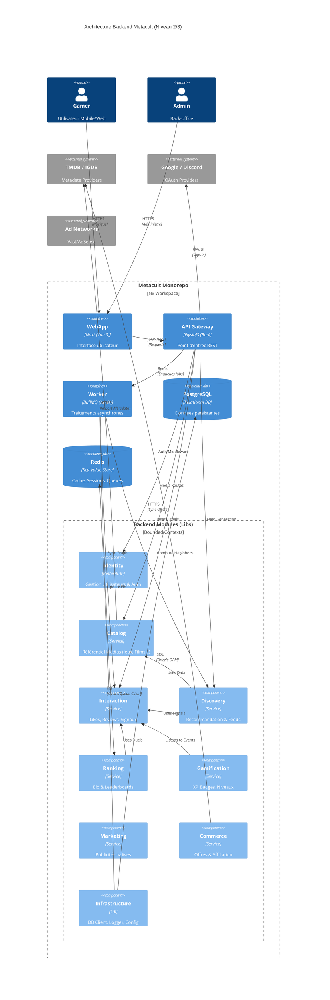

Ce diagramme illustre les interactions entre les applications, les modules backend et les systèmes externes.

```mermaid
C4Context
  title Architecture Backend Metacult (Niveau 2/3)

  Person(gamer, "Gamer", "Utilisateur Mobile/Web")
  Person(admin, "Admin", "Back-office")

  System_Ext(tmdb, "TMDB / IGDB", "Metadata Providers")
  System_Ext(google, "Google / Discord", "OAuth Providers")
  System_Ext(ads, "Ad Networks", "Vast/AdSense")

  Boundary(metacult, "Metacult Monorepo", "Nx Workspace") {

    Container(webapp, "WebApp", "Nuxt (Vue 3)", "Interface utilisateur")
    Container(api, "API Gateway", "ElysiaJS (Bun)", "Point d'entrée REST")
    Container(worker, "Worker", "BullMQ (Node)", "Traitements asynchrones")

    ContainerDb(postgres, "PostgreSQL", "Relational DB", "Données persistantes")
    ContainerDb(redis, "Redis", "Key-Value Store", "Cache, Sessions, Queues")

    Boundary(modules, "Backend Modules (Libs)", "Bounded Contexts") {
        Component(identity, "Identity", "BetterAuth", "Gestion Utilisateurs & Auth")
        Component(catalog, "Catalog", "Service", "Référentiel Médias (Jeux, Films...)")
        Component(interaction, "Interaction", "Service", "Likes, Reviews, Signaux")
        Component(discovery, "Discovery", "Service", "Recommandation & Feeds")
        Component(ranking, "Ranking", "Service", "Elo & Leaderboards")
        Component(gamification, "Gamification", "Service", "XP, Badges, Niveaux")
        Component(marketing, "Marketing", "Service", "Publicités natives")
        Component(commerce, "Commerce", "Service", "Offres & Affiliation")
        Component(infrastructure, "Infrastructure", "Lib", "DB Client, Logger, Config")
    }
  }

  %% External Flows
  Rel(gamer, webapp, "HTTPS", "Navigue")
  Rel(admin, webapp, "HTTPS", "Administre")
  Rel(api, google, "OAuth", "Sign-in")
  Rel(catalog, tmdb, "HTTPS", "Import Metadata")
  Rel(commerce, tmdb, "HTTPS", "Sync Offers")

  %% App Flows
  Rel(webapp, api, "JSON/REST", "Requests")
  Rel(api, worker, "Redis", "Enqueues Jobs")

  %% Module Internal Dependencies (Simplified)
  Rel(api, identity, "Auth Middleware")
  Rel(api, catalog, "Media Routes")
  Rel(api, interaction, "User Signals")
  Rel(api, discovery, "Feed Generation")

  %% Worker Flows
  Rel(worker, discovery, "Compute Neighbors")
  Rel(worker, ranking, "Update Elo")
  Rel(worker, interaction, "Sync Graph")

  %% Cross-Module Dependencies
  Rel(discovery, catalog, "Uses Data")
  Rel(discovery, interaction, "Uses Signals")
  Rel(gamification, interaction, "Listens to Events")
  Rel(ranking, interaction, "Uses Duels")

  %% Infra
  Rel(infrastructure, postgres, "SQL", "Drizzle ORM")
  Rel(infrastructure, redis, "TCP", "Cache/Queue Client")

  %% All modules use Infra
  UpdateLayoutConfig($c4ShapeInRow="2", $c4BoundaryInRow="1")
```
