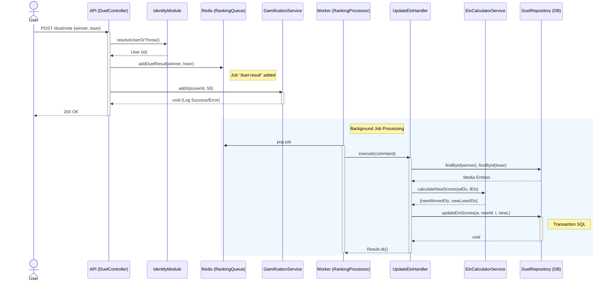

Ce diagramme détaille le flux d'exécution lors d'un vote sur un duel.
À noter : Le calcul Elo est asynchrone (Worker), tandis que le gain d'XP est actuellement déclenché de manière synchrone par le contrôleur.

